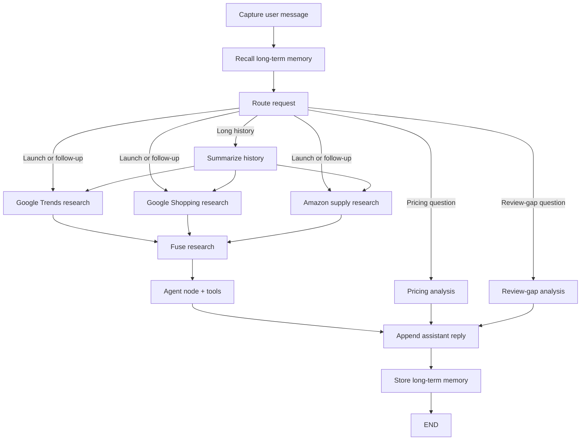

# LaunchLens

LaunchLens is a LangGraph-powered market-intelligence CLI agent for founders who want a fast Go / No-Go / Niche verdict before launching a product. It fuses demand signals from SerpApi with supply-side signals from Oxylabs, then turns the result into a compact launch brief.

## What LaunchLens does

- Accepts a plain-English product question in a chat loop.
- Pulls demand data from SerpApi (Google Trends / Google Shopping / Google News style signals).
- Pulls supply-side marketplace context from Oxylabs-style Amazon research.
- Fuses both sides into one verdict with demand, price band, and positioning guidance.
- Preserves short-term conversation state, summarizes longer conversations, and stores durable product facts in long-term memory.

## Quick start

1. Create and activate the virtual environment.
2. Install the project dependencies.
3. Copy the environment template and add any live API keys you want to use.
4. Start the CLI.

```bash
python -m pip install -e .
cp .env.example .env
python main.py --cli
```

## UI and API

Open [ui/index.html](ui/index.html) directly in a browser to use the static LaunchLens workbench. The UI calls `http://127.0.0.1:8000/chat` when an API server is running and falls back to mock-mode responses otherwise.

To run the optional API server:

```bash
python -m pip install -e ".[api]"
uvicorn api.app:app --reload
```

## Environment variables

- SERPAPI_KEY: optional; enables live SerpApi demand research.
- OXYLABS_API_KEY: optional; enables live Oxylabs supply research.
- OPENAI_API_KEY: optional; enables an LLM-backed agent node.
- OPENAI_MODEL: optional; defaults to gpt-4o-mini.

Copy [.env.example](.env.example) to .env before running the CLI or API server.

If the API keys are missing, LaunchLens runs in mock mode with bundled JSON fixtures.

## Demo prompts

- Should I launch a stainless-steel insulated water bottle in India under ₹1,500?
- What about the US market?
- Compare it with a cheaper bottle alternative.
- Is this product worth launching as a premium niche item?
- How should I position it for gift buyers and travelers?

## Architecture



## LangGraph Concept Map

1. Graph construction & state: [src/launchlens/state.py:8](src/launchlens/state.py) `LaunchLensState` defines typed state, [src/launchlens/reducers.py:6](src/launchlens/reducers.py) `merge_dicts` merges branch outputs, and [src/launchlens/graph.py:67](src/launchlens/graph.py) `build_graph` wires START through END.
2. Fan-out parallel execution: [src/launchlens/graph.py:18](src/launchlens/graph.py) `google_trends_research`, [src/launchlens/graph.py:32](src/launchlens/graph.py) `google_shopping_research`, and [src/launchlens/graph.py:43](src/launchlens/graph.py) `amazon_supply_research` branch from [src/launchlens/nodes/router.py:24](src/launchlens/nodes/router.py) `route_to_next` and merge at [src/launchlens/nodes/fusion.py:6](src/launchlens/nodes/fusion.py) `fuse_research`.
3. Routing conditional edges: [src/launchlens/nodes/router.py:6](src/launchlens/nodes/router.py) `classify_intent` labels pricing, review-gap, launch, and follow-up turns; [src/launchlens/nodes/router.py:24](src/launchlens/nodes/router.py) `route_to_next` selects the graph path; [src/launchlens/graph.py:86](src/launchlens/graph.py) `build_graph` installs the conditional edges.
4. Agent node + tools: [src/launchlens/agents/market_agent.py:16](src/launchlens/agents/market_agent.py) `run_agent` creates the agent and binds tools at line 23; [src/launchlens/tools/serpapi_tools.py:96](src/launchlens/tools/serpapi_tools.py) `search_google_trends`, [src/launchlens/tools/serpapi_tools.py:102](src/launchlens/tools/serpapi_tools.py) `search_google_shopping`, and [src/launchlens/tools/oxylabs_tools.py:50](src/launchlens/tools/oxylabs_tools.py) `search_amazon_supply` are LangChain tools returning slim JSON.
5. Short-term memory: [src/launchlens/memory/checkpoint.py:14](src/launchlens/memory/checkpoint.py) `get_checkpointer` creates the SQLite checkpointer used by [src/launchlens/graph.py:111](src/launchlens/graph.py) `build_graph`; [src/launchlens/nodes/summarizer.py:35](src/launchlens/nodes/summarizer.py) `summarize_history` compresses long conversations.
6. Long-term memory: [src/launchlens/memory/long_term.py:23](src/launchlens/memory/long_term.py) `LongTermMemoryStore` persists durable facts to SQLite, [src/launchlens/memory/long_term.py:79](src/launchlens/memory/long_term.py) `extract_memory_facts` extracts product, price, region, and verdict facts, [src/launchlens/nodes/long_term_memory.py:7](src/launchlens/nodes/long_term_memory.py) `recall_long_term_memory` recalls them before routing, and [src/launchlens/nodes/long_term_memory.py:14](src/launchlens/nodes/long_term_memory.py) `store_long_term_memory` stores them before END.

## Files

- [main.py](main.py): CLI entrypoint.
- [src/launchlens/graph.py](src/launchlens/graph.py): LangGraph graph assembly and CLI orchestration.
- [src/launchlens/memory/long_term.py](src/launchlens/memory/long_term.py): durable SQLite long-term memory store.
- [api/app.py](api/app.py): optional API adapter for health and chat calls.
- [ui/index.html](ui/index.html): static LaunchLens workbench UI.
- [docs/architecture.md](docs/architecture.md): architecture note with the graph overview.
- [docs/slides.md](docs/slides.md): presentation outline for a short demo deck.
- [docs/slides/README.md](docs/slides/README.md): notes for storing exported presentation assets.
- [data/fixtures/serpapi.json](data/fixtures/serpapi.json) and [data/fixtures/oxylabs.json](data/fixtures/oxylabs.json): mock data for development.
- [SUBMISSION.md](SUBMISSION.md): submission summary.

## Demo video

Use the CLI or UI demo flow above for a short recorded walkthrough.
