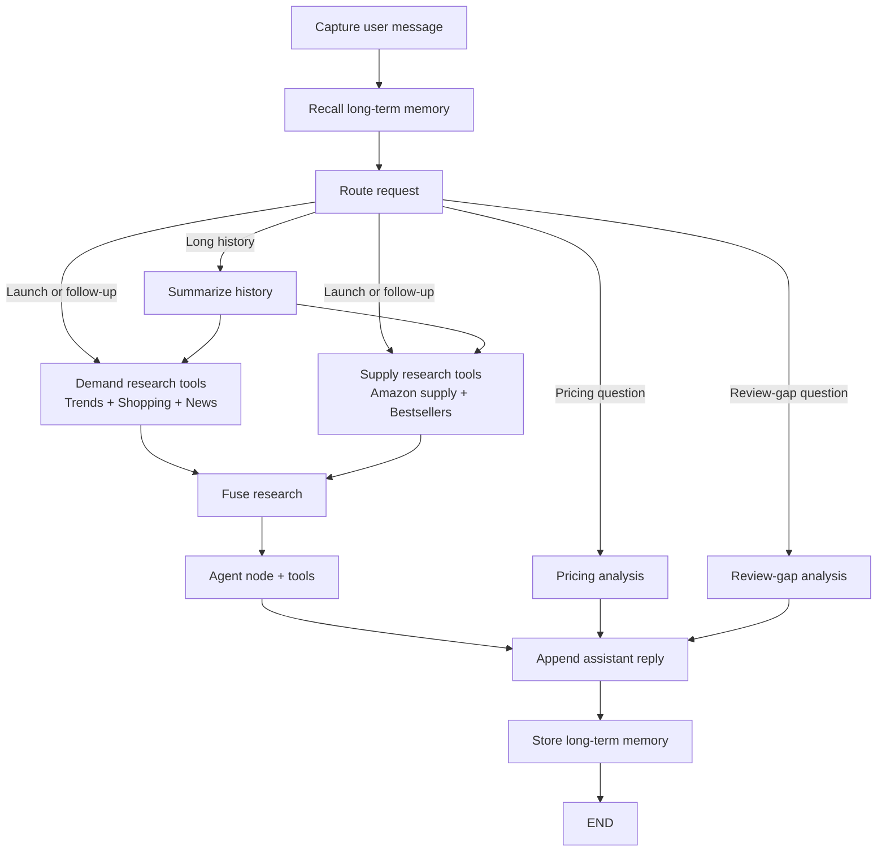

# LaunchLens architecture

## Graph overview

## Required LangGraph concepts

- Graph + state: [src/launchlens/graph.py](../src/launchlens/graph.py) builds a typed StateGraph around [LaunchLensState](../src/launchlens/state.py), with reducers that merge branch updates into a single state object.
- Routing: [router.py](../src/launchlens/nodes/router.py) classifies launch, pricing, review-gap, follow-up, and general intents before selecting a path.
- Fan-out: demand research branches for Google Trends, Google Shopping, and Google News run in parallel with supply research for Amazon supply and Amazon bestsellers before [fusion.py](../src/launchlens/nodes/fusion.py) merges the signals.
- Agent node + tools: [market_agent.py](../src/launchlens/agents/market_agent.py) can call SerpApi and Oxylabs-style tool wrappers, then falls back to deterministic verdict formatting when no LLM key is present.
- Short-term memory: the compiled graph uses a SQLite checkpoint when available plus [summarizer.py](../src/launchlens/nodes/summarizer.py) for longer conversations.
- Long-term memory: [long_term.py](../src/launchlens/memory/long_term.py) stores durable founder/product facts in SQLite, while [long_term_memory.py](../src/launchlens/nodes/long_term_memory.py) recalls facts before routing and stores new facts before END.

## Runtime flow

1. The CLI captures the founder's product idea and appends it to message history.
2. Long-term memory recalls prior product, price, region, and verdict facts for the same thread.
3. The router sends narrow pricing and review-gap questions to fast deterministic branches.
4. Launch and follow-up questions fan out across demand sources (Trends, Shopping, News) and supply sources (Amazon supply, Bestsellers) in parallel.
5. The fusion node creates a concise research summary for the agent and the verdict builder turns the merged signals into a launch brief.
6. The agent returns a Go, No-Go, or Niche-style launch brief with demand, pricing, positioning, review-gap, and memory context.
7. Long-term memory stores durable facts from the completed turn.

## API and UI

- [api/app.py](../api/app.py) wraps the graph in a small service with health and chat methods.
- If FastAPI is installed, `uvicorn api.app:app --reload` exposes `/health` and `/chat`.
- The static UI in [ui/index.html](../ui/index.html) can call the API server or use its built-in mock fallback for demos.
- The API service keeps thread state in memory so repeated calls with the same `thread_id` preserve conversation context.
- Long-term memory is also keyed by `thread_id`, so recalled facts survive process restarts through `long_term_memory.sqlite`.

## Offline mode

LaunchLens is demoable without external credentials. Missing API keys trigger bundled fixtures in [data/fixtures](../data/fixtures), so tests and CLI walkthroughs remain reproducible.
